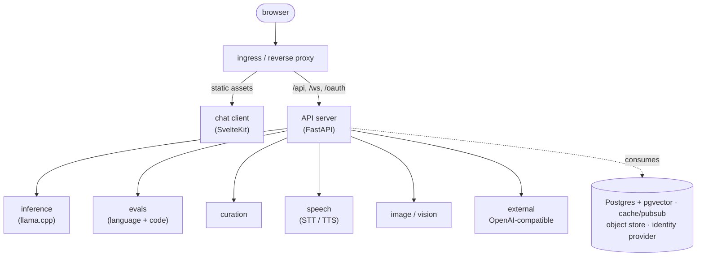

<div align="center">


# self.ai

**The self-hosted AI platform you actually own.**

A complete, open-source stack for running AI on your own terms — a multi-user chat
WebUI, an OpenAI-compatible API, local inference and fine-tuning, dataset curation, and
built-in evaluation harnesses. Bring your own models, database, and infrastructure.
Nothing leaves your network unless you send it there.

[](LICENSE)
[](#-project-status)
[](https://fastapi.tiangolo.com/)
[](https://kit.svelte.dev/)
[](#-bring-your-own-inference-backend)
[](CONTRIBUTING.md)
[](https://github.com/selfdothost/self.ai)

[Quick start](#-quick-start) · [Why self.ai](#-why-selfai) · [What's in the box](#-whats-in-the-box) · [Architecture](#-architecture) · [Docs](product-docs/index.md) · [Roadmap](ROADMAP.md) · [Contributing](CONTRIBUTING.md)

</div>

<div align="center">
  
</div>

---

## 🧭 Why self.ai

Most self-hosted AI today is a pile of parts you wire together yourself: a chat front-end
here, an inference server there, a vector database, a separate evaluation script, a
fine-tuning notebook that never quite makes it to production. self.ai is the whole loop —
**serve, retrieve, evaluate, curate, and train** — under one roof, GPLv3, and entirely
yours to deploy.

- **You own it end to end.** GPL-3.0. If you deploy it, it's yours — no seats, no metering,
  no calling home. Point it at your own models, your own database, your own hardware.
- **Multi-user from the ground up.** Forked from Open-WebUI's last MIT release specifically
  for a multi-user focus — real accounts, OAuth/OIDC, admin controls, and per-model
  permissions, not a single-user desktop application only.
- **Open specs over invented protocols.** Chat is OpenAI/Anthropic-compatible, so every existing
  client, SDK, and tool "Just Works". New protocols only where no open spec fits.
- **Bring your own everything.** Models, inference endpoints, database, object storage,
  identity provider — self.ai *consumes* infrastructure, it doesn't force-bundle it.
- **Beyond chat.** A built-in benchmark harness (IFEval, BBH, MMLU-PRO, GPQA, GSM8K, and
  more), a data-curation pipeline with a node-graph editor, and a training/fine-tuning
  control plane. This is a self-hosted AI Provider, not a front-end.

**Who it's for:** self-hosters and homelabbers who want AI they fully control · ML/AI
engineers who fine-tune, curate data, and run evals · privacy-conscious teams who need a
multi-user Inference and AI Tools Provider on their own infrastructure · and open-source \
developers who want to build on and extend a serious, modular platform.

> **⚠️ Public alpha.** This is the first public release — expect rough edges, and read the
> [project status](#-project-status) before you rely on it. It's real and it runs; it's
> also moving fast. Releases ship weekly (Tuesdays) — see [`CHANGELOG.md`](CHANGELOG.md).

---

## 🚀 Quick start

The fastest way to try self.ai is the combined single-container image — the API server and
chat client together, same-origin:

```bash
git clone https://github.com/selfdothost/self.ai.git
cd self.ai

cp .env.example .env
# edit .env — set WEBUI_SECRET_KEY, e.g.  openssl rand -hex 32
docker compose -f docker-compose.combined.yml up
```

Open **http://localhost:3000** and create your first account.

Prefer separate API + web containers? Use the split topology instead:

```bash
docker compose -f docker-compose.split.yml up
```

Nothing is enabled by default — no inference endpoint, no embeddings backend. self.ai
boots on local SQLite with every provider disabled, and you add exactly the ones you have.
Point it at a model (next section) and you have a working chat client. Full details,
reverse-proxy setup, and every environment variable are in
[`deploy/README.md`](deploy/README.md) and [`docs/config-reference.md`](docs/config-reference.md).

---

## 🔌 Bring your own inference backend

self.ai's API server speaks to **any OpenAI or Anthropic compatible endpoint** out of the box. If you
already have a token factory — a hosted OpenAI/Anthropic-compatible API, an existing
vLLM/SGLang deployment, your own llama.cpp or Ollama setup — point self.ai at it and skip
running a local model server entirely:

```bash
# .env
OPENAI_API_BASE_URLS=https://your-endpoint/v1
OPENAI_API_KEYS=sk-your-key

ENABLE_ANTHROPIC_API=true
ANTHROPIC_API_CONFIGS={"https://api.anthropic.com": {"key": "sk-ant-your-key"}}
```

Register multiple OpenAI-compatible backends by semicolon-separating both
`OPENAI_API_BASE_URLS` and `OPENAI_API_KEYS` (same order, same count). Native
connectors also exist for **Ollama** (`OLLAMA_BASE_URLS`) and self.ai's own
serving and training component (`LLAMOLOTL_BASE_URLS`). **Anthropic** is a
first-class Messages API provider with extended-thinking support, not an
OpenAI shim — its key lives inside `ANTHROPIC_API_CONFIGS`, keyed by base URL,
rather than a parallel keys array, since Anthropic authenticates per-endpoint
with `x-api-key`.

> **Note:** bring-your-own covers chat inference. Fine-tuning and qLoRA pipelines are wired
> to [`self.llamolotl`](https://github.com/selfdothost/self.llamolotl), self.ai's own
> serving/training backend. Training is built off of DeepSpeed, and is behind an in-house
> API Spec that reads training courses produced in .yaml files by self.chat. Support for more
> training backends is something we are interested in, if you have any suggestions please leave
> an issue with a brief for it. You are encouraged to create a mod to enable it as well.

---

## 📦 What's in the box

Only the **API server** is required. Everything else is optional and
can be swapped for any external service speaking the same protocol, including the frontend.

| Component | What it does |
| --- | --- |
| **API server** (FastAPI) | OpenAI/Anthropic-compatible chat/completions, retrieval, files, multi-user auth (OAuth/OIDC optional), admin config, and proxies to every satellite service |
| **Chat client** ([`self.chat`](https://github.com/selfdothost/self.chat), SvelteKit) | Conversations, folders, workspace, and admin panel — served same-origin, no CORS to configure |
| **Knowledge base (RAG)** | Document ingestion, chunking, embedding, and vector search over your own knowledge bases, with citations. SQLite by default; Postgres + pgvector when you want it |
| **Web access** | `web_fetch` reads a page you name; `deep_research` searches and follows links across sources; Web Crawl pulls a domain straight into a knowledge base. All honor `robots.txt` |
| **Inference + training** ([`self.llamolotl`](https://github.com/selfdothost/self.llamolotl)) | llama.cpp combined with DeepSpeed to enable fine-tuning and "from random" model training |
| **Evaluation** ([`self.language-eval`](https://github.com/selfdothost/self.language-eval)) | Built from lm-evaluation-harness, with an authenticated API endpoint for model completions |
| **Evaluation** ([`self.code-eval`](https://github.com/selfdothost/self.code-eval)) | Built from bigcode-eval, similar to [`self.language-eval`](https://github.com/selfdothost/self.language-eval); can be attached to a [`Piston`](https://github.com/engineer-man/piston) instance for defense-in-depth |
| **Data curation** ([`self.curator`](https://github.com/selfdothost/self.curator)) | Data-curation pipelines with a node-graph editor, attached to a knowledge base, built from NeMO Curator, designed for artists with minimal code experience |
| **Speech** ([`self.speak`](https://github.com/selfdothost/self.speak) TTS, [`self.transcribe`](https://github.com/selfdothost/self.transcribe) STT) | Self-hosted STT and TTS behind OpenAI-compatible endpoints, with per-model voice overrides |
| **Image + vision** (`self.sketch`, not yet on the public mirror) | In-chat image generation (self-hosted ComfyUI / SDXL) and local multimodal vision (e.g. Qwen2.5-VL) |
| **Mods** | An operator-installable extension system — a mod ships its own routes, tools, permission scopes, database tables, and Svelte UI, loaded same-origin |

Each satellite is optional: self.ai runs as a chat client against any OpenAI-compatible
endpoint without deploying any of them. See
[`docs/image-publish-policy.md`](docs/image-publish-policy.md) for what ships as an image
vs. build-from-source. Nothing here bundles a database, cache, or ingress — self.ai
consumes those, it doesn't ship them.

<div align="center">
  
  <br/><em>Built-in benchmark harness — run standard evals against any model you serve.</em>
  <br/><br/>
  
  <br/><em>Knowledge bases for retrieval — reference them inline in chat with <code>#</code>.</em>
</div>

---

## 🧩 Where self.ai fits

Most tools cover one slice of the stack. self.ai is the combination — owned and self-hosted.

| | Chat UI only | Inference server only | Hosted API | **self.ai** |
| --- | :---: | :---: | :---: | :---: |
| Multi-user chat WebUI | ✅ | ❌ | partial | ✅ |
| OpenAI-compatible API | ❌ | ✅ | ✅ | ✅ |
| Knowledge base / RAG | partial | ❌ | partial | ✅ |
| Built-in evaluation harness | ❌ | ❌ | ❌ | ✅ |
| Data curation pipelines | ❌ | ❌ | ❌ | ✅ |
| Fine-tuning / training | ❌ | partial | partial | ✅ |
| Self-hosted, GPLv3, no metering | varies | varies | ❌ | ✅ |
| Your data stays on your infra | varies | ✅ | ❌ | ✅ |

---

## 🏗 Architecture

self.ai is not a single application — it's an API server plus a separate client, with a set
of optional satellite services behind it, all sharing infrastructure you bring.



The client and API are served under **one origin**, path-routed by the proxy — so there's
no CORS to configure. Only the API server is required, and the chat frontend is recommended; every satellite is
optional and independently replaceable. Full detail, including the chat-completion request
path and GPU arbitration between inference/training/speech/sketch/eval jobs, is in
[`product-docs/architecture.md`](product-docs/architecture.md).

---

## 🛰 The stack

self.ai is a multi-repo project. This repo is the **flagship** — the API core and the
Docker files for the whole thing. Start here.

| Repo | Role |
| --- | --- |
| **[self.ai](https://github.com/selfdothost/self.ai)** (this repo) | Flagship — API server (`selfai_ui`, FastAPI) + Docker/compose for the stack |
| [self.chat](https://github.com/selfdothost/self.chat) | Web client (SvelteKit SPA) |
| [self.llamolotl](https://github.com/selfdothost/self.llamolotl) | Local inference + training (llama.cpp) |
| [self.curator](https://github.com/selfdothost/self.curator) | Data curation |
| [self.language-eval](https://github.com/selfdothost/self.language-eval) | Language-understanding evaluation harness |
| [self.code-eval](https://github.com/selfdothost/self.code-eval) | Multi-language code-execution evaluation harness |
| [self.speak](https://github.com/selfdothost/self.speak) | Text-to-speech |
| [self.transcribe](https://github.com/selfdothost/self.transcribe) | Speech-to-text |
| `self.sketch` | Image generation (ComfyUI-based; not yet on the public mirror) |

---

## 🖥 Hardware

self.ai itself is light — the API server is a small Python service and the web client is
static. **What it takes to run *models* is inherited from whatever inference engine and
model you choose, not from self.ai.** A small quantized model runs comfortably on modest
hardware; a large one needs a capable GPU.

Size your machine against your chosen engine and model/quant using that project's own
guidance (e.g. llama.cpp / Ollama for GGUF quant levels). self.ai imposes no hardware floor
of its own — and because you bring your own inference endpoint, it can front models running
anywhere, not just on the box serving the API.

---

## 📊 Project status

self.ai is **pre-v1.0 and under active development.** It shipped its first public release
as an alpha; releases publish weekly on Tuesdays ([`CHANGELOG.md`](CHANGELOG.md)). A few
things worth knowing before you evaluate it:

- Some subsystems are **shipped-but-partial** — image generation and vision were inherited
  from the fork and are being hardened; the product docs mark what isn't built yet on each
  page.
- The **mods** system (operator-installed, instance-wide extensions) is shipped end to end,
  and the first real mod, an agent orchestration engine, is being built against it now.
- Not every component image is published — some are build-from-source, due to
  container-image size limits. Please consider donating to help offset these costs

Where it's headed is in [`ROADMAP.md`](ROADMAP.md): a full chat-system overhaul (knowledge
bases integrated directly into chats, folders that carry a default model + included KBs),
then the differentiators — storage/VCS for large Knowledge Bases, evals, training, curation, and GPU job-window
control — that make an owned self.ai worth running.

---

## 📜 License

self.ai is licensed under **GPL-3.0** (see [`LICENSE`](LICENSE)). It is a hard fork of
**Open-WebUI v0.5.4** — the last MIT-licensed release — chosen for its multi-user focus.
The retained MIT-licensed upstream portions are preserved in [`NOTICE`](NOTICE); the
combined work and all self.ai additions are GPLv3.

self.ai is **not affiliated with or endorsed by Open-WebUI.** The fork does not track or
ingest post-v0.5.4 upstream code — see [`DIVERGENCE.md`](DIVERGENCE.md) for the full
provenance, the no-upstream-ingestion rule, and the licensing posture that follows from it.
Vendored eval/tooling and speech components keep their own upstream licenses, noted in
their subdirectories. Every fork here — eval harnesses, TTS, STT — exists to wrap an
upstream project behind self.ai's own API surface and strip anything not needed to serve
it, keeping images as lean as possible. It's all done with the utmost respect and
appreciation for the FOSS work it builds on; please consider donating to those upstreams.

---

## 🤝 Contributing

Contributions are welcome — see [`CONTRIBUTING.md`](CONTRIBUTING.md). Every commit needs a
DCO [`Signed-off-by`](https://developercertificate.org/) line, and AI-assisted work is
disclosed with an `Assisted-by:` trailer — a person stands behind each contribution.

Found a leftover Open-WebUI reference, a bug, or a rough edge? Open an
[issue](https://github.com/selfdothost/self.ai/issues). Please also read
[`CODE_OF_CONDUCT.md`](CODE_OF_CONDUCT.md) and, for anything sensitive,
[`SECURITY.md`](SECURITY.md).

<div align="center">
<br/>

**If self.ai looks useful, a ⭐ helps others find it.**

Built by [selfdothost](https://github.com/selfdothost). Self-hosted, and yours.

</div>
