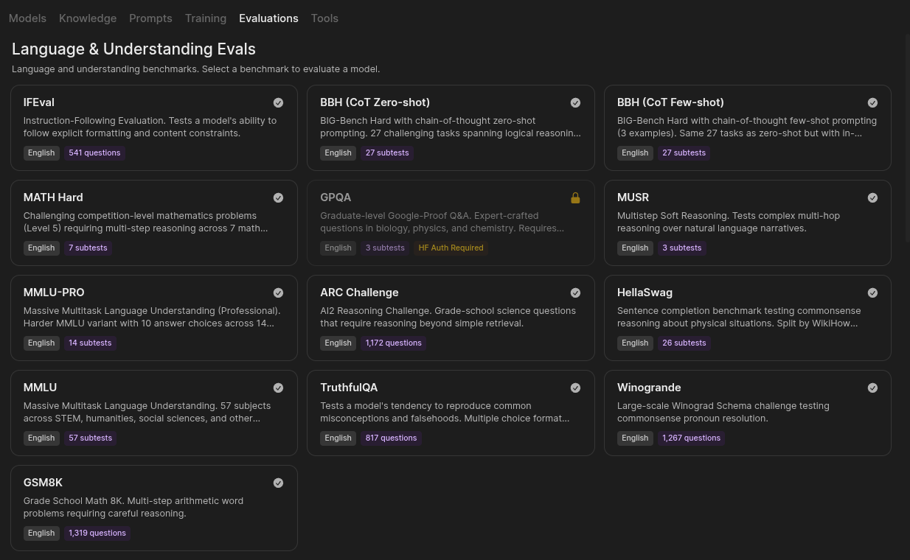
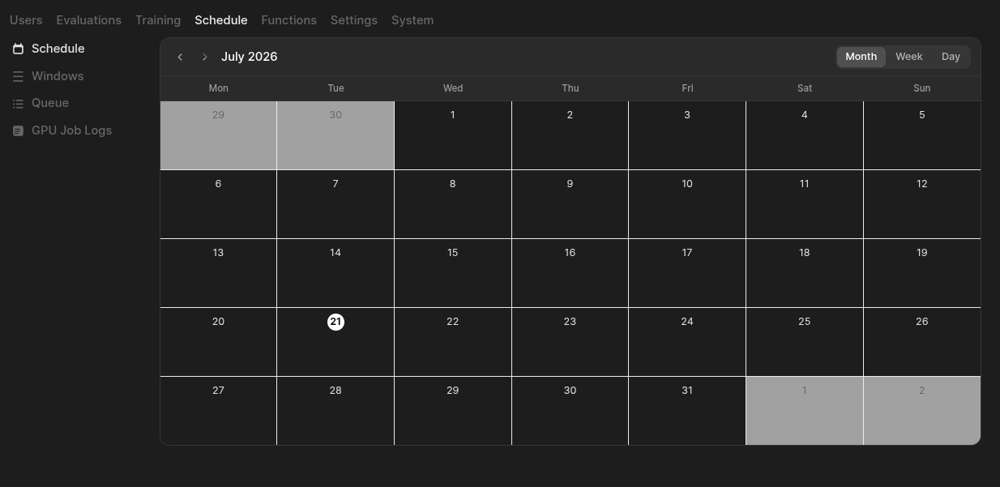

# Evaluation, Curation, and Training

self.ai ships four GPU-consuming workloads behind one scheduler:

| Workload | Backing service | Where in the UI |
|---|---|---|
| Language evaluations | `self.language-eval` (control plane on `:8096`) | Workspace → Evaluations |
| Code evaluations | `self.code-eval` (control plane on `:8094`) | Workspace → Evaluations |
| Data curation | `self.curator` (control plane on `:8094`) | Knowledge base → pipeline editor |
| Training runs | `self.llamolotl` training API (control port `:8093`) | Workspace → Training |

All four contend for the same GPU. In the reference deployment a single GPU node
serves inference (`self.llamolotl`) *and* runs curation; evaluation harnesses do
not hold the GPU themselves — they drive inference back through the self.ai API,
so a running eval still occupies the serving model. Arbitration is therefore not
Kubernetes scheduling but self.ai's own dispatcher: an admin-defined **job
window** decides which job types may start and when. See
[Architecture](architecture.md) for the service topology and
[Configuration](configuration.md) for the connection settings referenced here.

This page covers how these four workloads are built and how they're arbitrated. For step-by-step
"how do I do this" instructions, see [Curate a Dataset](guides/curate-a-dataset.md),
[Run an Evaluation](guides/run-an-evaluation.md), and [Train a Model](guides/train-a-model.md).

## Language evaluations

Language evals are backed by **self.language-eval**, a vendored fork of the
EleutherAI LM Evaluation Harness wrapped in a self.ai-specific FastAPI control
plane (`GET /api/tasks`, `POST /api/jobs`, `GET /api/results/{id}/samples`, …).
self.ai reaches it at `LANGUAGE_EVAL_BASE_URLS` (default
`http://self-language-eval:8096`).

The catalog surfaces the Open LLM Leaderboard v1 and v2 task groups: IFEval, BBH
(CoT zero-shot and few-shot), MATH Hard, GPQA, MUSR, MMLU-PRO, ARC Challenge,
HellaSwag, MMLU, TruthfulQA, Winogrande, and GSM8K. Each card shows language and
either question count or subtest count.

**Auth-gated benchmarks.** GPQA is shown locked with an *HF Auth Required*
badge: its dataset is gated on HuggingFace. No HuggingFace token is wired into
the language-eval deployment (`manifests/eval/language-eval.yaml` sets no
`HF_TOKEN`), so gated benchmarks cannot be run today. The curator deployment is
the only one that accepts an optional `HF_TOKEN` secret.

**Starting a run.** Creating a job (`POST /api/v1/evaluations/jobs/create`)
requires either admin or the `workspace.evaluations` permission. The job lands
as `pending`; an admin approves it (`/jobs/{id}/approve`) — approval fails if the
requesting user has no API key, since inference is authenticated as that user —
or rejects it, which cancels the job with "Rejected by administrator". Admins can
also set a future `scheduled_for` timestamp, or unschedule.

On dispatch, self.ai mints a short-lived, job-scoped eval token and posts a job
to language-eval with `base_url` pointing back at self.ai's own
`/api/chat/completions`. Every request the harness makes therefore flows through
self.ai's auth, model routing, and access control. **Test Mode** (`dry_run`) caps
a run at five samples so a benchmark returns quickly.

**Results.** Language-eval writes to its own volume; self.ai reads them live from
`GET /api/results` on the harness. The `LANGUAGE_EVAL_RESULTS_DIR` disk path in
the code is a first-choice source that is *not* mounted on the API pod in the
reference manifests — in practice the live fetch is the only path that returns
data. Live token-by-token progress is available per job via SSE
(`/jobs/{id}/live`) and afterwards as a replay (`/jobs/{id}/events`), enriched
with targets, scored responses, and per-sample metrics.

## Code evaluations

Code evals are backed by **self.code-eval**, a vendored fork of the BigCode
Evaluation Harness with its own FastAPI control plane. Its published image
bundles every MultiPL-E language runtime (Node/TypeScript, Java, Scala, Go, Ruby,
PHP, Lua with `luaunit`, R) so execution-based scoring works in one container.

Task coverage from the vendored harness includes HumanEval / HumanEval+ /
InstructHumanEval, MBPP / MBPP+, APPS, DS-1000, HumanEvalPack, the **MultiPL-E**
suite (HumanEval translated into 18 languages, selectable as `multiple-*`),
Recode, PAL-style GSM8K/GSM-Hard, CodeXGLUE code-to-text, CoNaLa, Concode, and
Mercury. `GET /api/tasks` and `GET /api/tasks/categories` on the harness are the
authoritative list for a given build.

self.ai talks to it over HTTP at `CODE_EVAL_BASE_URLS` (default
`http://self-code-eval:8094`): `POST /api/jobs` to dispatch, `GET /api/jobs/{id}`
to poll, `GET /api/results/{id}` and `/details` to collect. Inference for code
evals is pointed at `/api/completions` (raw text completion) rather than chat
completions, to avoid chat templating and thinking-mode artifacts.

Results are pulled back and persisted under `CODE_EVAL_RESULTS_DIR` on the API
pod when a job completes. If that fetch fails (code-eval serves one eval at a
time and can be busy at the moment of completion) a bounded reconciler retries
the backfill up to five times per job. Model output is HTML-escaped and
control-character-stripped before it is served to the UI.

## Result visibility

The access model is asymmetric, and worth stating plainly:

| Endpoint | Who can read |
|---|---|
| `GET /jobs` (evals, training) | Admins see all jobs; users see only their own |
| `GET /codetests`, `GET /codetests/{id}` | Admins see all; users see only results from runs they own |
| `GET /codetests/summary`, `/codetests/benchmark/{name}`, `/codetests/model-runs/{model}` | Admin only |
| `GET /langtests/summary`, `/langtests/model-runs/{model}`, `/langtests/{id}` | Admin only |
| `GET /jobs/{id}/events`, `/jobs/{id}/live` | Job owner or admin |

There is no public or per-result sharing toggle. Cross-model leaderboard views
(the summary and per-benchmark aggregates) are admin-only for both harnesses, and
language-eval per-run detail is admin-only even for the user who started the run —
that user still gets the streamed/replayed event view of their own job.

## Data curation

**self.curator** is a vendored fork of NVIDIA NeMo Curator with a self.ai control
plane. It is the only non-inference workload that requests the GPU directly in
the reference manifests.

self.ai proxies the curator API under `/curator/api/…`, minting a scoped service
ticket per call:

- `GET /api/text`, `GET /api/text/{category}/stages` — the built-in text stage
  catalog by category (quality filters, dedup, classifiers, …).
- `POST|GET|DELETE /api/text/custom/stages` — **custom stages**, user-authored
  stage definitions stored on the curator's volume. Reading stages needs a
  verified user; creating and deleting them is admin-only.
- `POST /curator/queue` — queues a `CuratorJob` row containing the full pipeline
  config. This is what the pipeline editor submits.

A pipeline is a node graph assembled against a knowledge base and submitted as a
single config blob. Dispatch is entirely daemon-driven: when a window allows it,
the dispatcher uploads the input JSONL over HTTP (`POST /api/data/upload` — the
curator pod cannot see the API's volume), posts the pipeline, and immediately
approves it on the curator side, which is a pure executor.

On completion self.ai **finalizes** the job: it creates a new Dataset knowledge
item marked `dataset` + `curated`, pulls each output file back over HTTP, registers
them as files, and links them to the dataset. If nothing is pulled the dataset is
still created, empty, and the failure is logged — check the job's logs when a
curated dataset shows up with no files.

## Training

Training has two objects. A **course** is the reusable recipe: datasets plus an
`advanced_config` (adapter/LoRA rank, alpha, dropout, LR and schedule, warmup,
weight decay, epochs' eval/save cadence, and a DeepSpeed offload choice of
`none` / `optimizer` (ZeRO-2, the default) / `full` (ZeRO-3)). A **job** binds a
course to a base model.

Lifecycle:

1. A user with read access to the course creates a job — it starts `pending`.
2. An admin **approves** (`POST /api/v1/training/jobs/{id}/approve`) or
   **rejects** it. Only `pending` or `scheduled` jobs can be approved or rejected.
3. Approval resolves each dataset: HuggingFace-backed knowledge bases are passed
   by HF id (with column format auto-detected against the HF datasets server),
   while curated/local datasets have their JSONL uploaded to the trainer node
   first. A job with no resolvable datasets is refused.
4. self.ai renders the training config to YAML, posts it to the llamolotl control
   API, approves it there, and records the remote job id. The job goes to
   `queued`; llamolotl reports back `running`/`completed`/`failed`.
5. Cancel is available to the owner or an admin and propagates to llamolotl.

A special `heretic` course id bypasses course lookup and dispatches to the
llamolotl pipeline-task API (`/api/heretic/run`) instead of the training API; its
status is polled from `/api/heretic/status/{id}`.

The dispatcher reconciles training status every cycle, and a job stuck in
`running` for more than 24 hours is auto-failed.

## GPU scheduling

Admin → Schedule is the operator surface: a calendar of windows, plus **Windows**,
**Queue**, and **GPU Job Logs**.

**Job windows.** A window (`/api/windows`, admin only) is a `start_at`/`end_at`
span with a name, an `enabled` flag, a `preferred_job_type`, and a set of
**slots**. Each slot names a job type (`training`, `language-eval`, `code-eval`,
`curator`) and carries `max_concurrent` and `min_remaining_minutes`. Windows are
explicit time spans — there is no recurrence field; each window is created for a
concrete period. An active, enabled window cannot be deleted until it is disabled
or ends.

Window gating exists because the GPU is single and serial: an unbounded queue
would start a multi-hour benchmark on top of a live serving model, or begin a
training run whose weights cannot coexist with the loaded model. Windows let an
operator say "curation and evals overnight, serving during the day", and
`min_remaining_minutes` plus the per-benchmark `max_duration_minutes` in
`/api/benchmarks` prevent starting a benchmark that cannot finish before the
window closes (an unknown benchmark is allowed through).

**The dispatcher** (`utils/gpu_queue.py`) polls every 30 seconds under a Redis
lock so only one API replica dispatches per cycle; if Redis is unavailable it
proceeds without the lock and relies on DB status checks. Each cycle it: syncs
running jobs from every worker, promotes due scheduled jobs and unscheduled
pending jobs to `queued`, dispatches `run_now` jobs unconditionally, then — only
if a window is active — runs a three-pass dispatch:

1. `high` priority, FIFO across all slot types in the window.
2. `normal` priority, preferred slot type first, then the other non-training types.
3. `normal` training as a fallback, up to the slot's remaining capacity.

**Priority tiers** are `run_now` (bypasses windows entirely), `high` (respects
windows, dispatched before all `normal` work), and `normal`. The Queue view lists
every `pending`/`queued`/`running`/`paused` job across all four types; admins can
`promote` a job to `high` or `run-now` it. Neither is permitted on a terminal job.

Before dispatching an eval, the dispatcher makes a best-effort call to unload any
other model resident in llamolotl, because llamolotl evicts by slot count rather
than free VRAM and a second large load can OOM. This is a mitigation, not a fix.

**GPU Job Logs** surface worker-side logs pulled per job from the control planes —
`/llamolotl/api/jobs/{id}/logs` for training and `/curator/api/jobs/{id}/logs` for
curation. The API keeps no unified GPU log store of its own; eval jobs expose
their event stream instead of a log endpoint.

## Not shipped yet

Be aware of the following gaps before relying on this surface:

- **Service-ticket auth is not enforced end to end.** self.ai mints a scoped
  `X-Selfai-Ticket` JWT on every outbound call to llamolotl, curator, code-eval,
  and language-eval. Per `utils/service_auth.py`, only llamolotl and curator are
  in the validating rollout; the code-eval and language-eval control planes as
  vendored here contain no ticket validation and will serve any in-cluster caller.
  Keep those services on cluster-internal addresses and do not expose them.
- **Gated HuggingFace benchmarks cannot run.** No `HF_TOKEN` is plumbed into the
  eval deployments; GPQA stays locked in the catalog.
- **No shared results volume for language-eval.** The API pod does not mount
  language-eval's results PVC, so the disk-read path in the code is inert and
  result listing depends on the language-eval pod being reachable.
- **No public prebuilt images.** llamolotl, curator, and both eval harnesses are
  built from the Dockerfiles in their repositories and pushed to your own
  registry; the manifests reference that registry, not a public one.
- **A second, unused eval queue exists.** `routers/evaluations.py` still defines
  `process_eval_queue`; only `process_gpu_queue_v2` is started at boot. The older
  loop is dead code.
- **Result sharing is fixed.** There is no user-facing public/private toggle for
  eval results; visibility is exactly the owner/admin split in the table above.
- **Curator failure modes are quiet.** A finalize that pulls zero output files
  still creates a dataset; the only signal is a warning in the API log.
