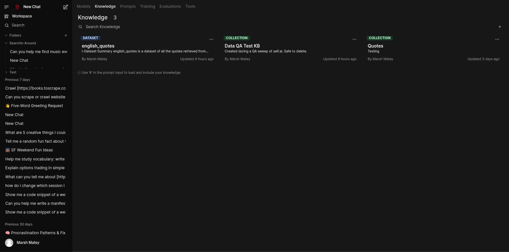

# Create a Knowledge Base

A **knowledge base** is a collection of documents a model can retrieve from. This page covers
creating one and getting content into it. For the retrieval settings that control how it's
searched (chunking, embedding model, reranking), see [Configuration](../configuration.md).

## Create the collection

1. Go to **Workspace → Knowledge** and click **+** in the top-right corner.
2. Choose **Create Knowledge Base**.
3. Name it, describe what it's for, and set **Visibility** (defaults to **Public** — accessible to
   all users — change it to Private if that's not what you want).
4. Click **Create Knowledge**.

## Add content

Open the new collection's **Files** tab and click **+** to add content. Every option here lands in
the same collection:

- **Upload files** — pick files from your device directly.
- **Upload directory** — upload a whole folder at once.
- **Sync directory** — keep the collection in sync with a directory going forward, rather than a
  one-time upload.
- **Add text content** — write or paste text straight into a titled note in the built-in editor.
- **Scrape a webpage** — pull in a single page by URL.
- **Crawl a website** — a resumable, tracked job that pulls in a whole site.

Documents from a crawl or scrape can come back with generic, repeated filenames (e.g. everything
named after the site title) — check the **SIZE** column if you need to tell them apart, since the
name alone may not.

## Use it in chat

Type `#` in the message box and pick the collection. The retrieved passages get added to the
model's context for that turn, with citations back to the source documents. To make a knowledge
base available automatically in every conversation with a particular model instead, attach it when
you [create that model](create-a-model.md).

## Pull in an existing dataset instead

If you want an existing public dataset rather than your own documents, use **+ → Add Dataset**
from the Knowledge list (not from inside a collection) and give it a HuggingFace dataset path
(`org/dataset-name`). See [Curate a Dataset](curate-a-dataset.md) for that flow, and for building
your *own* dataset from a knowledge base via the curation pipeline.

## See also

- [Using self.ai](../using-selfai.md#knowledge-bases) — the concept and retrieval-in-chat details
- [Curate a Dataset](curate-a-dataset.md) — pipelines and pulling external datasets
- [Configuration](../configuration.md) — chunking, embedding, and reranking settings
