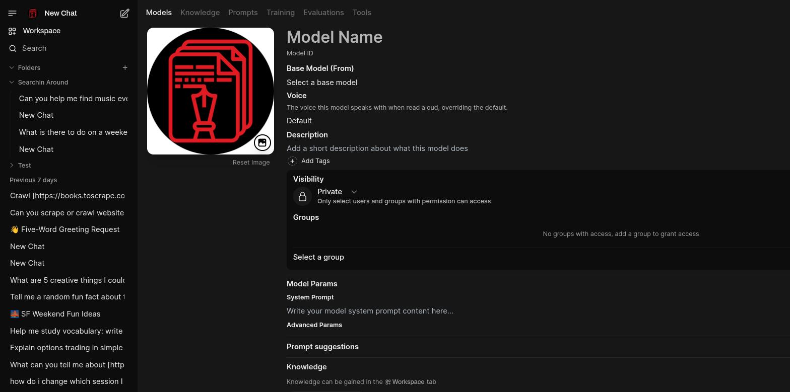

# Create a Model

A **workspace model** wraps a base model (local or connected) with a system prompt, sampling
parameters, and optionally a set of knowledge bases and tools that are always available to it.
Once created it appears in the model selector like any other model, and can be shared with other
users or groups.

## Steps

1. Go to **Workspace → Models** and click **+** in the top-right corner.
2. Give it a **Model Name**. A **Model ID** is generated from it automatically (you can edit the ID
   directly if you want a specific one).
3. Pick a **Base Model (From)** — any connected or locally served model your instance exposes.
4. Optionally set a **Voice** override (used when this model's replies are read aloud), a
   **Description**, and **Tags**.
5. Set **Visibility** — Private (only you, plus anyone you grant access via Groups) or Public.
6. Under **Model Params**, write a **System Prompt** and, if you need them, expand **Advanced
   Params** for sampling settings.
7. Under **Knowledge**, click **Select Knowledge** to attach one or more knowledge bases — their
   contents become available to this model in every conversation without needing `#` in the
   message box.
8. Attach **Tools**, **Filters**, or **Actions** if you've built any (see
   [Extending self.ai](../extending.md)), and adjust **Capabilities** (Vision, Citations) if needed.
9. Click **Save & Create**.

## See also

- [Using self.ai](../using-selfai.md#custom-models) — what a custom model is for
- [Create a Knowledge Base](create-a-knowledge-base.md) — build something to attach to a model
- [Extending self.ai](../extending.md) — writing Tools and Functions
