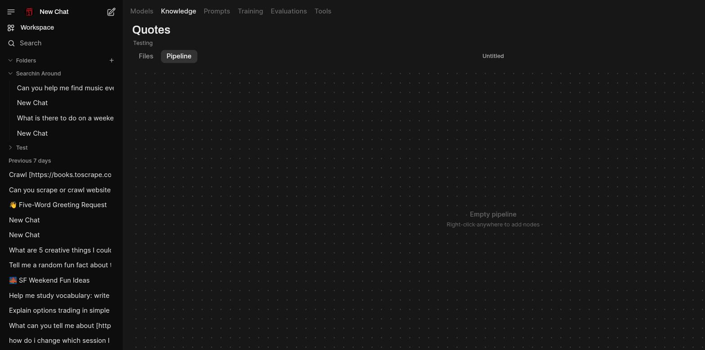

# Curate a Dataset

A **Dataset** is a knowledge item that Training courses draw on. There are two ways to get one:
pull an existing dataset in from HuggingFace, or build your own out of a knowledge base with the
curation pipeline editor. This page covers both, in order of how easy they are today.

## Pull an existing dataset from HuggingFace

The fast path, and currently the more reliable one (see the known issue below).

1. Go to **Workspace → Knowledge** and click **+** in the top-right corner.
2. Choose **Add Dataset**.
3. Enter the **HuggingFace Dataset Path** (e.g. `Abirate/english_quotes`). Name and Description
   auto-fill from HuggingFace if you leave them blank.
4. Set **Visibility** and click **Add Dataset**.

It shows up in the Knowledge list tagged **DATASET**, alongside your knowledge base collections,
and can be attached to a [Training course](train-a-model.md) from there.

## Curate your own dataset with a pipeline

Every knowledge base has a **Pipeline** tab (open a collection from **Workspace → Knowledge**) —
a node-graph editor backed by self.curator (a fork of NVIDIA NeMo Curator). The intended flow:

1. Open a knowledge base's **Pipeline** tab.
2. Right-click anywhere on the empty canvas to open the **Add Node** menu, and build a graph:
   a source reading from the knowledge base, one or more transform/filter stages (quality filters,
   dedup, classifiers, and more — see the built-in stage catalog), and a sink.
3. **Save** the pipeline, then click **Queue** to submit it.
4. Watch progress under **Job History**, at the bottom of the Pipeline tab.
5. On completion, self.ai creates a new **Dataset** knowledge item for you automatically, pulls the
   output files back, and links them to it. If a completed job produced a dataset with no files,
   check the job's log — a pull that comes back empty still creates an (empty) dataset rather than
   failing loudly.

!!! warning "Known issue: right-click add-node currently crashes"
    In testing, right-clicking the canvas to open the Add Node menu triggers a Svelte
    reactivity crash (`effect_update_depth_exceeded`) that leaves the whole canvas unresponsive for
    the rest of the session — no menu appears, and no further interaction with that pipeline works
    until you reload. Tracked as **self.chat#28**. Until it's fixed, pulling an existing dataset
    from HuggingFace (above) is the dependable path to get a Dataset attached to a Training course.

## See also

- [Evaluation, Curation, and Training](../evaluation-and-training.md#data-curation) — the curator
  architecture, dispatch model, and finalize behavior in detail
- [Train a Model](train-a-model.md) — what a course does with a dataset once it's attached
