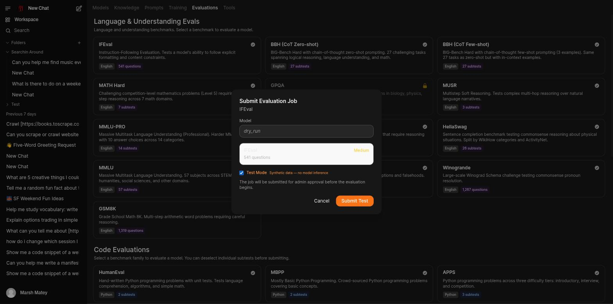

# Run an Evaluation

self.ai ships a real benchmark catalog — language/understanding suites (IFEval, MMLU, GSM8K, and
more) and code suites (HumanEval, MBPP, MultiPL-E, and more) — that you can run against any model
your instance exposes.

## Submit a job

1. Go to **Workspace → Evaluations**.
2. Pick a benchmark card. Multi-subtest benchmarks (like HumanEval or MultiPL-E) let you deselect
   individual subtests before submitting; single-benchmark cards (like IFEval) don't need that
   step.
3. In the **Submit Evaluation Job** dialog, either:
      - pick a real **Model** to evaluate, or
      - check **Test Mode** to validate the harness itself with synthetic data — no real model
        runs, and the Model field locks to a fixed `dry_run` value.
4. Click **Submit Job** (or **Submit Test** in Test Mode).

The job lands **pending**, and the dialog tells you it needs admin approval before it starts.

!!! warning "Known issue: Test Mode jobs can sit queued indefinitely"
    Test Mode is meant to be a safe, GPU-free way to check the harness, but as deployed it still
    queues behind the same GPU-window scheduler as real inference jobs (see
    [GPU scheduling](../evaluation-and-training.md#gpu-scheduling)) — so outside an active window
    it can sit in `queued` with nothing happening. There's also no distinguishable **Approve**
    action visible for evaluation jobs in Admin → Schedule (unlike Training, which has one) despite
    the dialog promising approval. Both tracked as **self.ai#64**.

## Watch it run and read results

Your submitted jobs appear under **Your Evaluation Jobs** on the same page, each tagged
`completed`, `cancelled`, `failed`, or in progress. Click a job to open its details and, once it's
finished, its per-sample results.

!!! warning "Known issue: a failed job's detail view doesn't say why it failed"
    Opening a `failed`-status job currently shows the same "results aren't available yet, try
    again" message a still-running job would show, rather than the actual error. Tracked as
    **self.ai#65**.

## See also

- [Evaluation, Curation, and Training](../evaluation-and-training.md) — harness architecture,
  result visibility rules, and GPU scheduling in full
