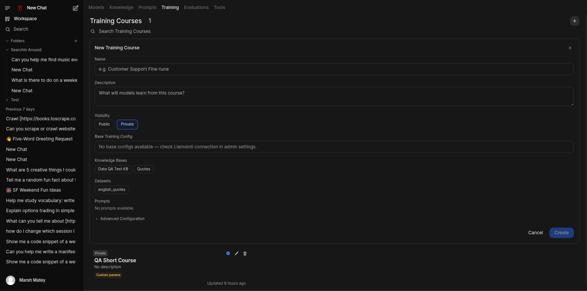
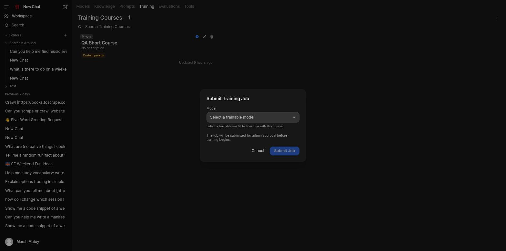

# Train a Model

Training has two objects: a **Course** is the reusable recipe (datasets plus hyperparameters), and
a **Job** binds a course to a specific base model and runs it.

## Create a course

1. Go to **Workspace → Training** and click **+** (or **Create your first course** if you have
   none yet).
2. Name it and describe what it's for. Set **Visibility**.
3. Optionally pick a **Base Training Config** — a saved starting point for the hyperparameters
   below, if your instance has one registered.
4. Attach the **Knowledge Bases**, **Datasets**, and **Prompts** this course should train on.
5. Expand **Advanced Configuration** to review or change the hyperparameters: epochs, batch size,
   gradient accumulation, learning rate and scheduler, optimizer, LoRA adapter settings (rank,
   alpha, dropout), and performance options (quantized loading, gradient checkpointing, flash
   attention, sequence length). The defaults are reasonable for a first run.
6. Click **Create**.

## Submit a job

1. On the course's card, click the blue **Submit Training Job** icon.
2. Pick a **trainable model** from the dropdown — only models flagged trainable on your instance
   appear here.
3. Click **Submit Job**.

The job goes to **Pending Approval**. An admin approves or rejects it from
**Admin → Training → Jobs**, where both actions are available as distinct icons on the job row.

!!! warning "Known issue: approval can fail with \"no valid datasets configured\""
    In testing, a course with a HuggingFace-sourced dataset clearly attached (visible in the
    course's own Edit view) was still rejected at approval time with "Course has no valid datasets
    configured," and no further explanation. The likely cause is a schema mismatch — the trainer
    expects specific columns (an instruction/output pair, or a chat `messages` format) that a raw
    HuggingFace dataset may not have — but that check currently runs silently at approval time
    instead of when the dataset is attached. Also worth knowing: **Base Training Config** may show
    "No base configs available — check Llamolotl connection in admin settings" even when that
    connection is fine; there's currently no admin UI to register a base training config. Tracked
    as **self.ai#66**.

## See also

- [Evaluation, Curation, and Training](../evaluation-and-training.md#training) — the full job
  lifecycle, dataset resolution, and the `heretic` special case
- [Curate a Dataset](curate-a-dataset.md) — where a course's datasets come from
