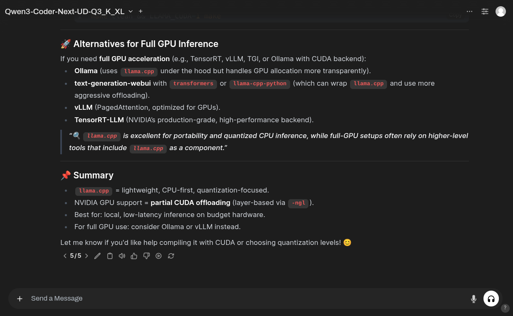
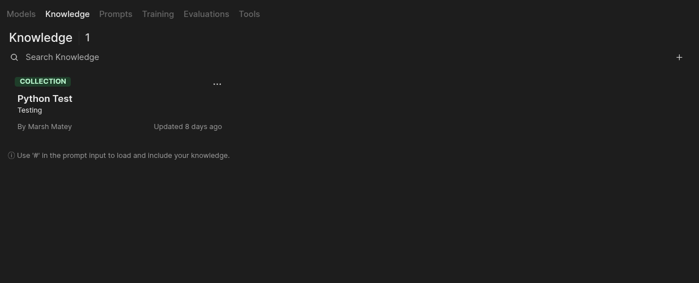

# Using self.ai

This page covers the day-to-day user surface: conversations, organizing them, working with
your own documents, and the workspace. Administrator tasks live in
[Configuration](configuration.md); benchmarking and training live in
[Evaluation and training](evaluation-and-training.md).

## Chat

Pick a model from the selector at the top of the conversation, type in the message box, and
send. Responses stream by default.

The model selector lists everything the instance exposes to you: models from any configured
OpenAI-compatible connection, locally served models, and any workspace models an admin has
defined. You can add more than one model to a conversation to compare answers side by side.

### Working with a response

Each assistant message carries controls beneath it:

| Control | What it does |
| --- | --- |
| Edit | Modify the message in place |
| Copy | Copy the raw markdown |
| Read aloud | Speak the response, if a TTS backend is configured |
| Rate | Thumbs up/down — feeds the arena and feedback evaluation data |
| Continue | Continue a truncated response |
| Regenerate | Re-run the turn |

Where a response has several variants, the counter (for example `5/5`) steps between them.

### Code blocks

Code in a response is syntax-highlighted with a copy button. Python blocks can be executed
directly from the message.

!!! note "Code runs in your browser, not on the server"
    Execution uses Pyodide (CPython compiled to WebAssembly) inside a web worker in your
    own browser. Packages are fetched at runtime. Nothing is executed on the self.ai
    server, and the code has no access to the server's filesystem or network position.

### Attachments and voice

The `+` control beside the message box attaches files to a conversation. The microphone
records a voice message for transcription, and the headphone control starts a hands-free
call-style session. Both require the relevant speech backends to be configured — see
[Configuration](configuration.md).

## Organizing conversations

| Feature | What it does |
| --- | --- |
| Folders | Group related conversations in the sidebar |
| Pin | Keep a conversation at the top of the list |
| Archive | Remove from the active list without deleting |
| Tags | Label conversations for search |
| Clone | Duplicate a conversation to branch from it |
| Share | Produce a shareable link, if sharing is enabled on the instance |
| Search | Full-text search across your conversations |

Conversation titles and tags can be generated automatically by a task model; an admin
configures which model does that work.

!!! info "Folder presets are not available yet"
    The data model for attaching a default model, tool set, and knowledge scope to a folder
    exists in the backend, but nothing consumes it and there is no interface to set it.
    Folders today are organizational only.

## Knowledge bases

A knowledge base is a collection of documents that a model can retrieve from. Create and
manage them under **Workspace to Knowledge**. See
[Create a Knowledge Base](guides/create-a-knowledge-base.md) for the step-by-step walkthrough.

To use one in a conversation, type `#` in the message box and pick the collection. The
retrieved passages are added to the model's context for that turn, with citations back to
the source documents.

### Getting content in

Documents can be added by uploading files directly, or ingested from:

- Plain text
- A web page
- A crawled site — crawls are resumable and run as a tracked job
- A YouTube URL (transcript)
- A web search, using whichever search backend the instance has configured

Supported search backends include SearXNG, Brave, Bing, Google PSE, Tavily, DuckDuckGo,
Mojeek, Kagi, Firecrawl, and several others. An admin picks and configures one.

### How retrieval is configured

Chunking, the embedding model, the reranking model, the number of results, and the RAG
prompt template are all instance-level settings under the admin panel's Documents section.
They are not per-user. See [Configuration](configuration.md) for the specifics, including
the constraint that core runs no models in-process and therefore requires an external
embedding backend.

## Workspace

**Workspace** is where reusable pieces live.

| Section | What it holds |
| --- | --- |
| Models | Custom model definitions — a base model plus a system prompt, parameters, attached tools and knowledge |
| Knowledge | Document collections and datasets |
| Prompts | Reusable prompts, invoked in chat by typing `/` |
| Training | Training courses and jobs |
| Evaluations | Benchmark catalog and results |
| Tools | Model-callable functions |

### Custom models

A workspace model wraps an underlying model with a system prompt, sampling parameters, and
optionally a set of tools and knowledge bases that are always available to it. Once saved,
it appears in the model selector like any other model, and can be shared with other users
or groups depending on its access control settings. See [Create a Model](guides/create-a-model.md)
for the step-by-step form.

### Prompts

A saved prompt is invoked by typing `/` followed by its command name. Prompts support
placeholder variables, so a saved prompt can template a repeated request rather than
hard-code it.

### Tools

Tools are Python functions a model can call mid-conversation — fetch a value, hit an API,
compute something. Attach them to a custom model, or enable them per-conversation.

Writing one is covered in [Extending self.ai](extending.md).

## Memories

self.ai can retain facts about you across conversations. Memories are managed from your
account settings, added explicitly rather than inferred silently, and can be listed,
edited, and deleted individually.

## Channels

A Slack-style channel surface with threads and reactions exists in the codebase and is
shipped behind an admin toggle labelled **Channels (Beta)**. It is off by default. Treat it
as beta: it is present and functional, not finished.

## What is not shipped

Named plainly so you do not go looking:

- **Folder presets** — backend model only, no interface and no consumer.
- **Server-side code execution** — chat code execution is browser-side only.

## See also

- [Extending self.ai](extending.md) — tools, functions, and pipelines
- [Evaluation and training](evaluation-and-training.md) — benchmarks, curation, training
- [Configuration](configuration.md) — the settings behind everything above
- [Guides](guides/create-a-model.md) — step-by-step walkthroughs: creating a model, a knowledge
  base, a dataset, running an evaluation, and training a model
